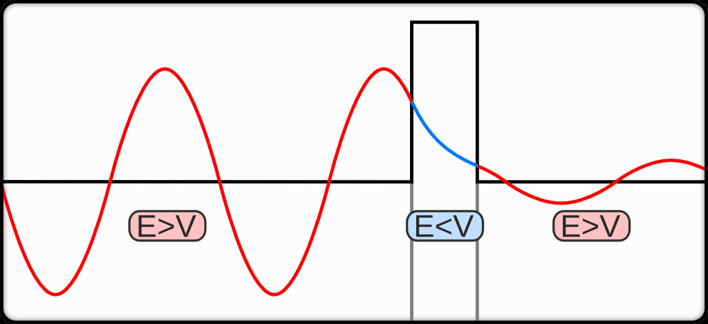

# TDSE_1d
###### 一维含时薛定谔方程（time depedent Schrödinger equation, TDSE）的Crank-Nelson格式数值解  

&emsp;&emsp;含时演化需要保证波函数的归一性不变，因此离散格式不能是向前欧拉(explicit)或向后欧拉(implicit)，而采用Crank-Nelson方法，保证波函数演化步骤不发散，维持概率守恒：  

$$
|\psi(t+\Delta t)|^2=|\psi(t)|^2
$$  

### 模拟有限势垒的[量子隧穿效应](https://en.wikipedia.org/wiki/Quantum_tunnelling)  
&emsp;&emsp;薛定谔方程在形式上是个虚时演化的反应-扩散微分方程（reaction-diffusion differential equation），本项目模拟薛定谔方程在一维的两点边值问题。扫描隧道显微镜（Scanning Tunneling Microscope，STM）就是一种利用量子隧穿效应的非光学显微镜。    

***一：平面波的势垒穿透***   

&emsp;&emsp;入射波为 $Ae^{ikx}$ 碰上处于 $x=[0, d]$ 之间的势场 $V(x)$  

***二：高斯波包势垒穿透***   
&emsp;&emsp;一般来讲，高斯波包是[自由粒子](https://en.wikipedia.org/wiki/Free_particle)哈密顿量 $H_0$ 的本征态叠加，而自由粒子的本征态就是平面波：  
$$\begin{aligned}
H_0 &= -\frac{\hbar^2}{2m}\left(\frac{\partial^2}{\partial x^2}+\frac{\partial^2}{\partial y^2}+\frac{\partial^2}{\partial z^2}\right)\\
\psi(x,y,z,t) &= A(k)e^{i[(k_xx+k_yy+k_zz)-\omega(k) t]}
\end{aligned}$$  
一维高斯波包的振幅为  
$$
A(k) = \left(\frac{1}{\sigma \sqrt{\pi}}\right)^{1/2}
$$

***三：谐振子势***  